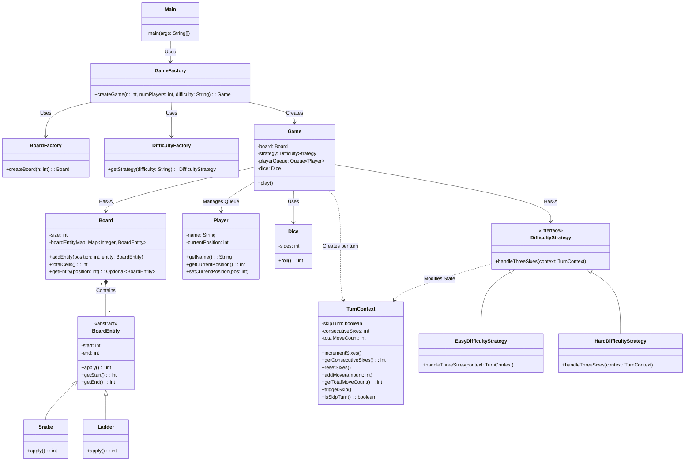

# 🐍🪜 Snake and Ladder Game

A robust, terminal-based Snake and Ladder game engineered in Java. This project emphasizes clean architecture, applying
SOLID principles, the Strategy Pattern, and the Factory Pattern to create a highly extensible and maintainable codebase.

## ✨ Features

* **Dynamic Board Generation:** Play on any $N \times N$ board size.
* **Smart Entity Placement:** Automatically generates $N$ Snakes and $N$ Ladders. The algorithm mathematically
  guarantees that entities do not overlap, do not start/end on the same row (preventing horizontal moving walkways), and
  do not create infinite loops.
* **Multiplayer Support:** Supports a custom number of players taking turns in a continuous loop.
* **Configurable Difficulty Levels:**
    * **Easy:** Rolling three consecutive 6s resets your counter and grants another roll.
    * **Hard:** Rolling three consecutive 6s instantly ends your turn and forfeits all accumulated movement for that
      turn.
* **Cycle-Free Architecture:** Utilizes a `TurnContext` to prevent "Ghost Movements" and decouple game rules from the
  main execution loop.

## 🏗️ Architecture & UML Class Diagram

The application is strictly divided into Entities (State), Strategies (Rules), Factories (Creation), and the Engine (
Execution) to ensure zero architectural overlap.



## 🚀 How to Run

### Prerequisites

* Java Development Kit (JDK) 11 or higher installed on your machine.

### Compilation & Execution

1. Clone the repository and navigate to the root directory.
2. Compile the Java files:
   ```bash
   javac SnakeAndLadderGame/src/*.java
   ```
3. Run the application:
   ```bash
   java SnakeAndLadderGame.src.Main
   ```

### Gameplay Instructions

Upon starting the game, you will be prompted to enter:

1. **Board Dimension ($N$):** Enter a number (e.g., `10` for a standard 100-cell board).
2. **Number of Players:** Enter the total amount of players.
3. **Difficulty:** Type `easy` or `hard`.

The game will automatically simulate the dice rolls and display the action turn-by-turn until one player successfully
lands exactly on the final cell.